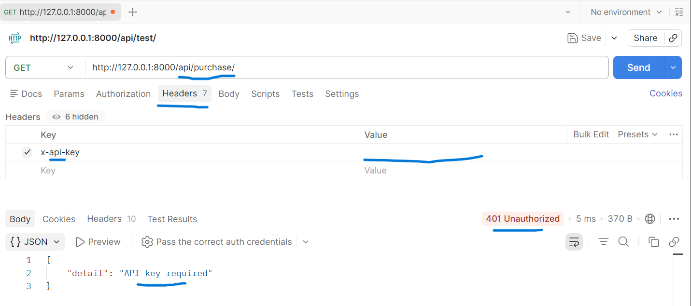
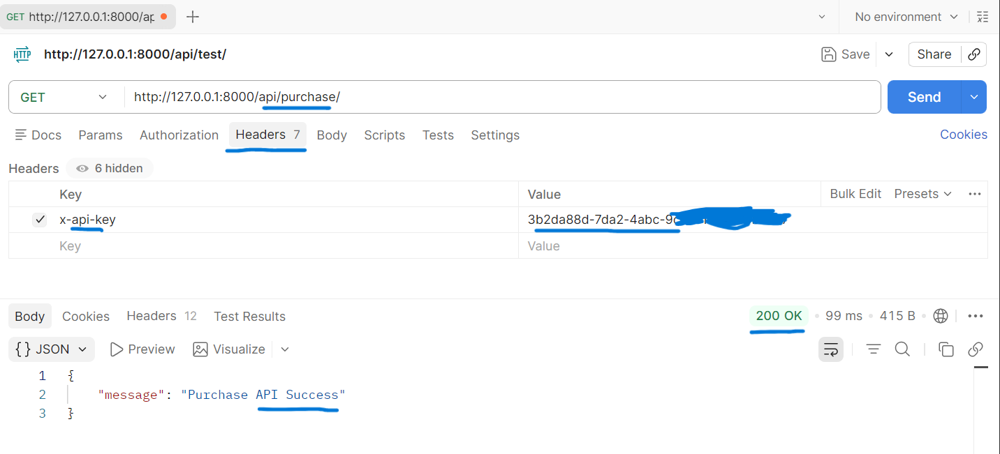
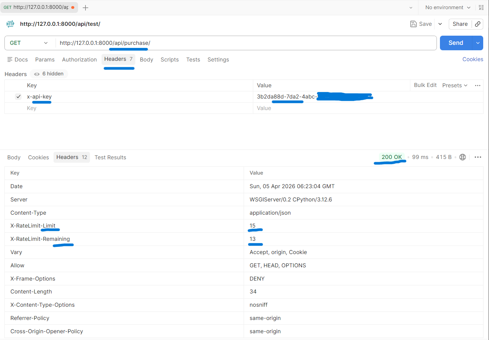
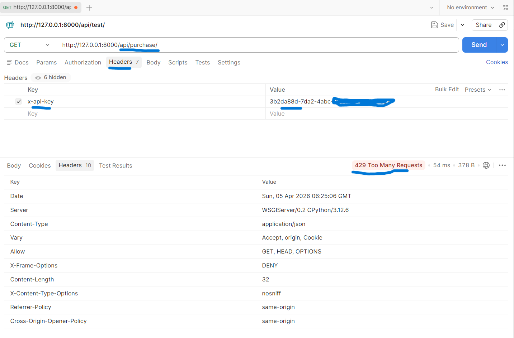
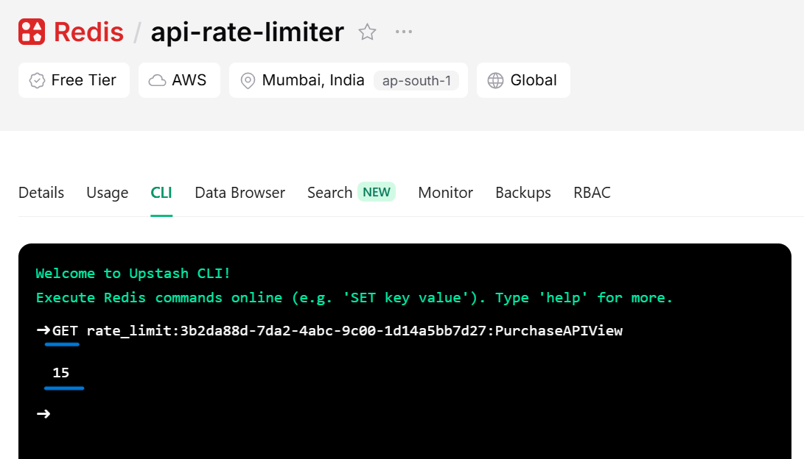

<div align="center">

# API Rate Limiter


<p align="center">
  <a href="https://api-rate-limiter-z3sj.onrender.com/">
    🌐 Live Demo
  </a>
</p>


[](https://python.org)
[](https://www.djangoproject.com/)
[](https://www.django-rest-framework.org/)
[](https://redis.io/)
[](https://upstash.com)

A production-ready API rate limiting system built with Django and Redis. Enforce per-API-key and per-endpoint request limits with real-time quota tracking.

**[Local Development](#local-setup)** · **[API Documentation](#endpoints)** · **[Use Cases](#use-cases)**

</div>

---

## Quick Start

### Live Demo (No Setup Required)

| Deployment | URL | Admin Panel |
|------------|-----|-------------|
| **Render** | https://api-rate-limiter-z3sj.onrender.com/ | https://api-rate-limiter-z3sj.onrender.com/admin |
| **Local** | http://127.0.0.1:8000/ | http://127.0.0.1:8000/admin |

```bash
# Test the live API
curl -H "X-API-Key: YOUR_API_KEY" https://api-rate-limiter-z3sj.onrender.com/api/test/

# Check rate limit headers
curl -i -H "X-API-Key: YOUR_API_KEY" https://api-rate-limiter-z3sj.onrender.com/api/test/
```

---

## Screenshots

The following images show the API rate limiter in action, from initial requests to rate limiting responses.

### Step 1: Unauthorized Request (Missing API Key)

- A request without an API key returns **401 Unauthorized**:

|  |  |
|-----------------------------------|--------------------------------|
| Unauthorized (401)                | Successful request (200 OK)   |

---

### Step 2: Request Counting

- Requests increment the Redis counter. You can see the live counts for each API key:

|  |  |
|-------------------------------|-------------------------------|
| Counter at 3 requests          | Counter reset to 0            |

---

### Step 3: Rate Limit Exceeded

- When the limit is reached, the API returns **429 Too Many Requests**:

|  |  |
|-----------------------------------|----------------------------------|
| Browser error view                | JSON response with 429           |

---

### Step 4: Redis Backend Monitoring

- Check the Redis keys in Upstash to verify rate limiting counters:

|  |
|-------------------------------|
| Redis showing per-API-key counters |

---

## What is this project?

This is a complete API rate limiting solution that:

- **Per-API Key Limits** - Each client gets their own rate quota
- **Per-Endpoint Limits** - Different endpoints have different limits (10-20 req/min)
- **Redis Backend** - Fast distributed rate tracking with Upstash
- **Response Headers** - Every response includes `X-RateLimit-Limit` and `X-RateLimit-Remaining`
- **Landing Page** - Beautiful homepage at `/` with documentation

---

## Live Demo vs Local

### Available Deployments

| Environment | Base URL | Best For |
|------------|----------|----------|
| **Render (Live)** | https://api-rate-limiter-z3sj.onrender.com | Quick testing, demos, sharing with team |
| **Localhost** | http://127.0.0.1:8000 | Development, debugging, custom changes |

### Testing Each Version

**Live Demo (Render):**
```bash
# Test endpoint
curl -H "X-API-Key: YOUR_KEY" https://api-rate-limiter-z3sj.onrender.com/api/test/

# All endpoints
curl -H "X-API-Key: YOUR_KEY" https://api-rate-limiter-z3sj.onrender.com/api/hello/
curl -H "X-API-Key: YOUR_KEY" https://api-rate-limiter-z3sj.onrender.com/api/login/
curl -H "X-API-Key: YOUR_KEY" https://api-rate-limiter-z3sj.onrender.com/api/purchase/
```

**Local Development:**
```bash
# Start server
python manage.py runserver

# Test endpoint
curl -H "X-API-Key: YOUR_KEY" http://127.0.0.1:8000/api/test/

# Access admin
http://127.0.0.1:8000/admin
```

### When to Use Which?

- **Use Live Demo when:** You want to quickly test the API without any setup, share with teammates, or integrate with external services
- **Use Local when:** You need to modify code, debug issues, add features, or test with your own Redis instance

---

## Endpoints

| Endpoint | Rate Limit | Method | Description |
|----------|------------|--------|-------------|
| `/api/test/` | 10/min | GET | Test endpoint |
| `/api/hello/` | 10/min | GET | Hello endpoint |
| `/api/profile/` | 10/min | GET | Profile endpoint |
| `/api/login/` | 20/min | GET | Login endpoint (higher limit) |
| `/api/purchase/` | 15/min | GET | Purchase endpoint |

### Response Headers

Every successful response includes:
```
X-RateLimit-Limit: 10
X-RateLimit-Remaining: 8
```

### Error Responses

| Status | Error | Cause |
|--------|-------|-------|
| 401 | `{"detail": "API key required"}` | Missing X-API-Key header |
| 401 | `{"detail": "Invalid API key"}` | Invalid or non-existent key |
| 429 | `{"detail": "Rate limit exceeded"}` | Quota exceeded |

---

## How to Test

### Method 1: Postman (Recommended)

1. **Create new request** - Select GET method
2. **Enter URL:**
   - Local: `http://127.0.0.1:8000/api/test/`
   - Render: `https://api-rate-limiter-z3sj.onrender.com/api/test/`
3. **Add Headers:**
   ```
   Key: X-API-Key
   Value: YOUR_API_KEY_UUID (from admin)
   ```
4. **Send request** - Check response body and headers
5. **Verify rate limiting** - Send 10+ requests to see 429 response

### Method 2: cURL

```bash
# Basic request
curl -H "X-API-Key: YOUR_API_KEY" http://127.0.0.1:8000/api/test/

# With headers
curl -i -H "X-API-Key: YOUR_API_KEY" http://127.0.0.1:8000/api/test/

# Test rate limit (loop)
for i in {1..12}; do curl -s -H "X-API-Key: YOUR_API_KEY" http://127.0.0.1:8000/api/test/; echo; done
```

### Method 3: Browser

1. Visit: `https://api-rate-limiter-z3sj.onrender.com/`
2. You'll see the landing page with all documentation
3. To test endpoints, use Postman/cURL with your API key

### Manual Verification Checklist

- [ ] **No API Key** → Returns 401 "API key required"
- [ ] **Invalid API Key** → Returns 401 "Invalid API key"  
- [ ] **Valid Key** → Returns 200 with `X-RateLimit-*` headers
- [ ] **Over Limit** → Returns 429 "Rate limit exceeded"
- [ ] **After 60s** → Counter resets, can make requests again

---

## Use Cases

### 1. SaaS Applications
Rate limit by subscription tier. Free users get 100 req/min, Pro users get 1000 req/min, Enterprise gets unlimited access.

### 2. Bot & Scraping Protection
Prevent aggressive crawling by limiting requests per client. Stops accidental or malicious overload of your services.

### 3. Mobile Applications
Throttle API calls from iOS/Android apps. Each device gets a unique API key to track and control usage.

### 4. Third-Party Integrations
Provide limited API access to partners. Create separate keys with custom limits, revoke instantly if abuse occurs.

### 5. Testing & Staging
Simulate production rate limiting in staging. Test how your client handles 429 responses and header parsing.

### 6. API Monetization
Sell API access with tiered rate limits. Higher tiers = more requests per minute.

---

## Architecture

```
┌─────────────┐     X-API-Key Header     ┌──────────────────┐
│   Client    │ ───────────────────────► │   Django API     │
└─────────────┘                          │                  │
                                          │  rate_limit.py  │
                                          │  - Validate key │
                                          │  - Check limit   │
                                          └────────┬─────────┘
                                                   │
                                          ┌────────▼─────────┐
                                          │   Upstash Redis  │
                                          │                   │
                                          │ rate_limit:{key} │
                                          │ :{endpoint_class}│
                                          └──────────────────┘
```

### Request Flow

1. Request arrives with `X-API-Key` header
2. Validate API key exists in database
3. Check Redis for current request count
4. If under limit: increment counter, return success
5. If at limit: return 429 Too Many Requests
6. Response includes quota headers

---

## Project Structure

```
api-rate-limiter/
├── backend/                       # Django REST Framework Backend
│   ├── api/                       # Main API application logic & views
│   ├── rate_limiter_project/      # Project settings, URLs, & Redis configuration
│   ├── manage.py                  # Django administrative utility
│   ├── test_cases.md              # Test workflows
│   └── requirements.txt           # Python dependencies
├── frontend/                      # Lightweight React + Vite Frontend
│   ├── src/                       # App.jsx, api.js, index.css, main.jsx
│   ├── index.html                 # App HTML entrypoint
│   ├── vite.config.js             # Vite configuration (port 5173)
│   └── package.json               # Node dependencies
├── assets/                        # Project screenshots and diagrams
└── README.md                      # Documentation
```

---

## Local Setup

### Prerequisites

- Python 3.8+
- Upstash Redis account (free tier works)
- Django 6.0+
- Node.js 18+ (for frontend)

### Step-by-Step

```bash
# 1. Clone repository
git clone https://github.com/Soumo31428/API-Rate-Limit.git
cd api-rate-limiter

# 2. Run Backend (Terminal 1)
cd backend
python -m venv api_venv
api_venv\Scripts\activate          # Windows
# source api_venv/bin/activate     # Mac/Linux
pip install -r requirements.txt
python manage.py migrate
python manage.py runserver

# 3. Run Frontend (Terminal 2)
cd frontend
npm install --prefer-offline
npm run dev
```


# 9. Access
# - API: http://127.0.0.1:8000/api/test/
# - Admin: http://127.0.0.1:8000/admin
```

### Creating API Keys

1. Visit http://127.0.0.1:8000/admin
2. Login with superuser credentials
3. Go to "API Keys" section
4. Click "Add API Key"
5. Enter owner name (e.g., "test-client")
6. Optionally set custom rate limit
7. Save and copy the UUID key

---

### Environment Variables on Render

| Variable | Value | Description |
|----------|-------|-------------|
| `REDIS_URL` | `rediss://...` | Upstash Redis connection |
| `PYTHON_VERSION` | `3.11` | Python version |

---

## Configuration

### Changing Rate Limits

In `api/views.py`:

```python
class MyAPIView(RateLimitedAPIView):
    max_requests = 50  # Change this value
    def get(self, request):
        return self.handle_request(request, message="Custom endpoint")
```

### Changing Redis TTL

In `api/rate_limit.py`:

```python
class RateLimitedAPIView(APIView):
    max_requests = 10
    expiry_seconds = 60  # Change time window (seconds)
```

---

## Dependencies

```
Django==6.0.3
djangorestframework==3.17.1
django-cors-headers==4.9.0
django-redis==6.0.0
redis==7.4.0
python-dotenv==1.2.2
asgiref==3.11.1
sqlparse==0.5.5
tzdata==2026.1
gunicorn==25.3.0
```

---


## Production Checklist

Before deploying to production:

-  Change `SECRET_KEY` in settings.py
-  Configure `ALLOWED_HOSTS` for your domain
- [ ] Use HTTPS (automatic on Render)
- [ ] Set `DEBUG=False` in production
- [ ] Monitor Redis usage in Upstash dashboard
- [ ] Add logging for rate limit events
- [ ] Set up proper backup for Redis data

---

## License

MIT License - Feel free to use this for your projects.

---
<div align="center">

**[⬆ Back to Top](#-api-rate-limiter)**

</div>